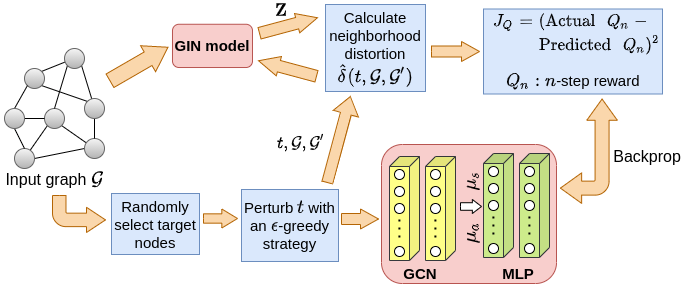
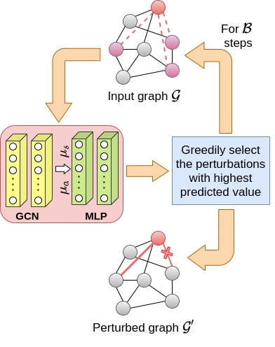

# Task and Model Agnostic Adversarial Attack on Graph Neural Networks
Code for the paper accepted at AAAI 2023 Safe and Robust AI track. Preprint available [here](https://arxiv.org/abs/2112.13267)

## Requirements
We use Python 3.6 to run each file. Our code is largely based on PyTorch and uses PyTorch Geometric, which can be installed following the steps noted [here](https://pytorch-geometric.readthedocs.io/en/latest/notes/installation.html) for your specific system configuration. The code is tested to work with PyTorch 1.8, which can also be installed for your specific configuration following these [steps](https://pytorch.org/get-started/locally/).

In addition to these, the other requirements can be installed by running `pip install -r requirements.txt`.

## Data & tools
We use the 3 standard citation datasets - Cora, Citeseer, Pubmed in this work. These are available in the Planetoid class of the torch_geometric library and will be downloaded automatically.

## Train attack models
Our code supports training of the following attack models and for each of them, we list the specified **model_name**, **layer** and **model_save_name** (which are parameters in the `train_base_model.sh`).

| Model | model_name | layer | model_save_name |
|-|-|-|-|
| GCN | Deep | gcn | model-${model_name}-${layer} |
| SAGE | Deep | sage | model-${model_name}-${layer} |
| GAT | Deep | gat | model-${model_name}-${layer} |
| GNN-Guard | GNNGuard | gcn | model-${model_name}-${layer} |
| PGNN | PGNN |  | model-${model_name} |

&nbsp;

Then, one needs to follow the following steps in order to train an attack model for a specific task. 

1. Open `train_base_model.sh`
2. Change the field of **dataset** to the specified dataset (for example, cora).
3. Change the **model_name**, **layer** and **model_save_name** according to the above table.
4. Change the **hidden_dim, n_epochs, dropout_rate, lr, batch_size** parameters according to your choice (denoting dimension of the hidden layers, number of epochs, dropout rate, initial learning rate, and batch size). Note that the no. of hidden layers can changed in the **hidden_layers** parameter passed to the file `train_model.py`.
5. Run `./train_base_model.sh`

## TANDIS: Targeted Attack via Neighborhood DIStortion

<!--  
 -->
&nbsp;

### Train the embedding model

1. Open `train_base_model.sh`
2. Change the field of **dataset** to the specified dataset (for example, cora).
3. Change **model_name=Deep** and **layer=gin** (can change layer).
4. Ensure that **model_save_name=model-${model_name}-${layer}**.
5. Change **down_task=unsupervised**.
6. Choose specific **hidden_dim, n_epochs, dropout_rate, lr, batch_size**. 
7. Run `./train_base_model.sh`

### Train the RL model

1. Open `train_attack.sh`.
2. Change the **dataset** variable to your choice.
3. Other variables can be adjusted accordingly as well. 
4. Run `./train_attack.sh`

### Generate attacks 

1. Open `run_attack.sh`
2. Change **dataset** to your specific dataset name (among cora, citeseer, pubmed).
3. Choose a specific attack model (**basemod=${model_name}-${layer}**, as defined in the above table).
4. Select the specific downstream task **down_task** from the following choices:
    1. node_classification
    2. link_prediction
    3. link_pair (for pairwise node classification)
5. Select a specific **budget** for the attack
6. Run `./run_attack.sh` which will print performance of our attack for different budgets.

Note that `main.py` uses multiprocessing to evaluate the performance across multiple target nodes efficiently and in a parallel way. 

#### **Evaluate attacks**

In addition to find attack a specific model for a specific task, we can also alternatively generate the perturbations as generated by the trained model and then use these perturbations to evaluate the performance of different attack models and downstream tasks. In order to do this, one needs to pass the argument **save_sols_only** to `main.py` in the `run_attack.sh`. Further, we can provide the filename to save the perturbations in the argument **save_sols_file** of `main.py`.

Then, we can evaluate the attack performance using the file `run_baselines.sh`.
1. Change the variables **dataset, basemod, down_task, budget** according to your choice.
2. Run `./run_baselines.sh` to evaluate the performance of our attack on specific attack scenario. 

Note that `eval_attack.py` also uses multiprocessing to evaluate the performance across multiple target nodes efficiently and in a parallel way. 

## Interpretability
The file `Interpretability/eda_TANDIS_comm.py` is used to get the results for interpretability. All one needs to do is run `python Interpretability/eda_TANDIS_comm.py`.

1. Since we have conducted the experiment on cora only, that is hardcoded and not taken as a parameter.
2. It would generate two csv files, one containing spearman's correlation of distortion scores for each target, with various properties, and the second one would similarly contain the corresponding pvalues.

## Citation

> @article{sharma2021task,\
   title={Task and Model Agnostic Adversarial Attack on Graph Neural Networks},\
   author={Sharma, Kartik and Verma, Samidha and Medya, Sourav and Ranu, Sayan and Bhattacharya, Arnab},\
   journal={arXiv preprint arXiv:2112.13267},\
   year={2021} \
 }
​
